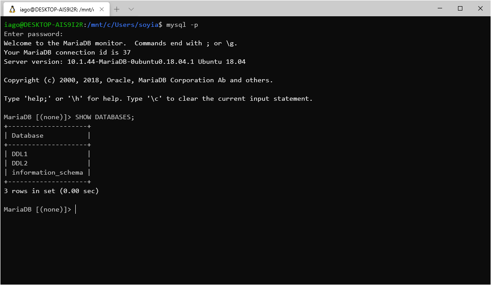
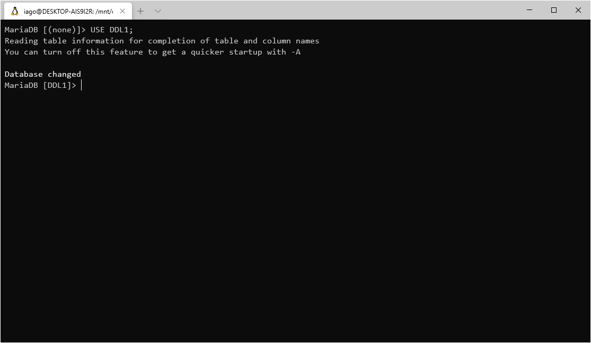
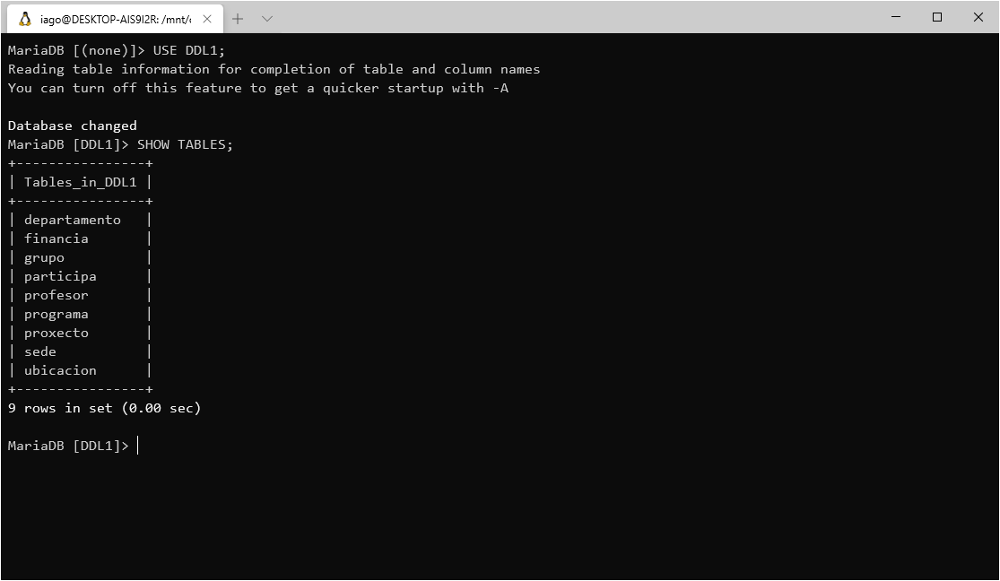
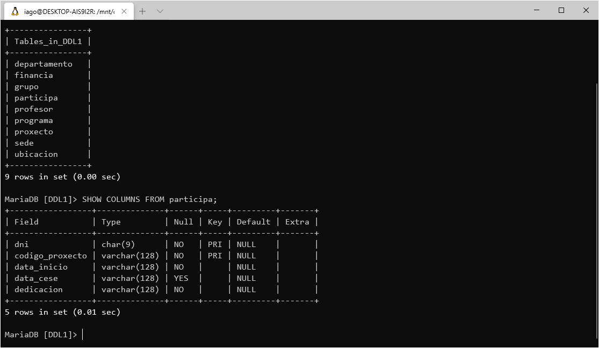
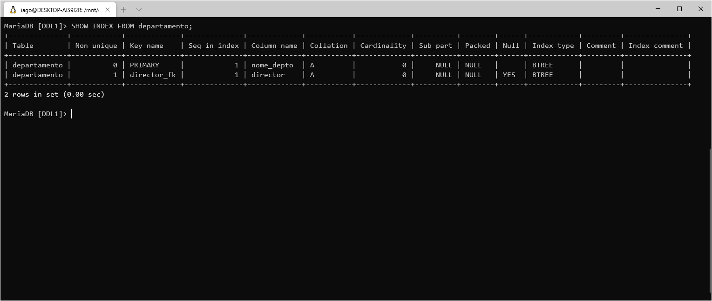
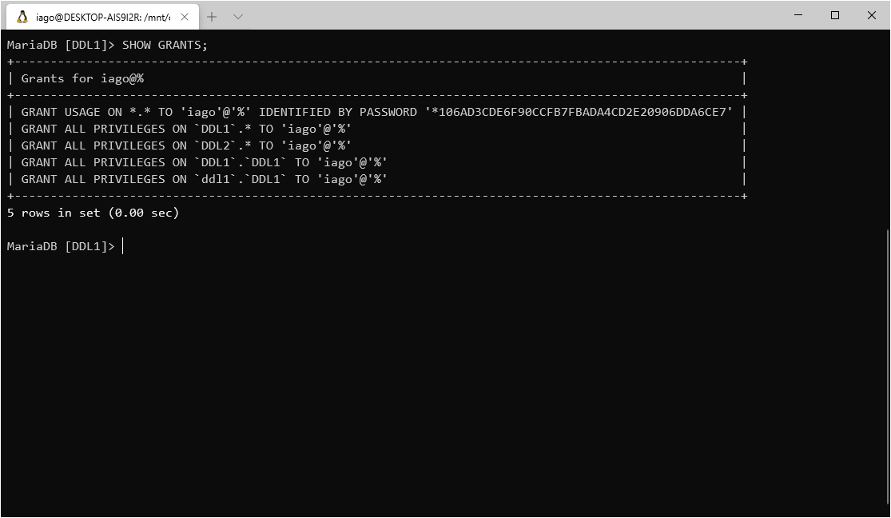

# Comandos de estructura
En MariaDB podemos facer uso da clausula `SHOW` para ver a estructura das bases de datos do servidor.

## Indice
- [Listar as bases de datos](#listar-as-bases-de-datos)
- [Listar as taboas dunha base de datos](#listar-as-taboas-dunha-base-de-datos)
- [Ver as columnas dunha taboa](#ver-as-columnas-dunha-taboa)
- [Ver as restriccións dunha taboa](#ver-as-restriccións-dunha-taboa)
- [Ver os permisos do usuario](#ver-os-permisos-do-usuario)

## Listar as bases de datos
Podemos, nada maís entrar ó servidor, lanzar a consulta:

```sql
SHOW DATABASES;
```



## Listar as taboas dunha base de datos

Poñemonos sobre unha base de datos, neste exemplo usamos [DDL1](../mariadb-ejericio-ddl1/README.md).

```sql
USE DDL1;
```



Agora, ca base de datos seleccionada, facemos a consulta:

```sql
SHOW TABLES;
```



## Ver as columnas dunha taboa

Executamos a consulta:

```sql
SHOW COLUMNS FROM participa;
```



## Ver as restriccións dunha taboa

Podemos ver unha lista cas restricción vixentes executando:

```sql
SHOW INDEX FROM departamento;
```




## Ver os permisos do usuario

Para listar os permisos do usuario actual na base de datos executamos:

```sql
SHOW GRANTS;
```


