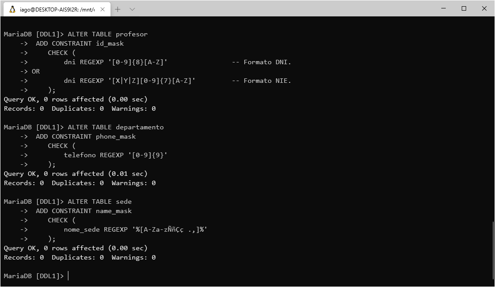
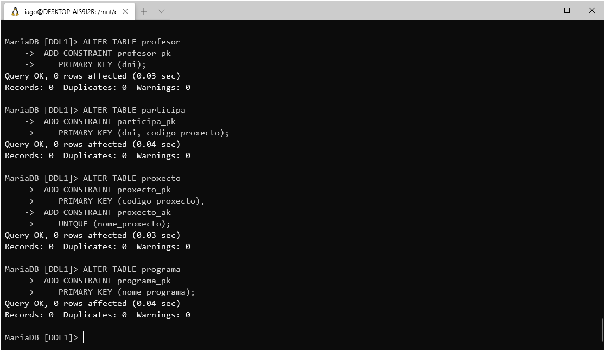
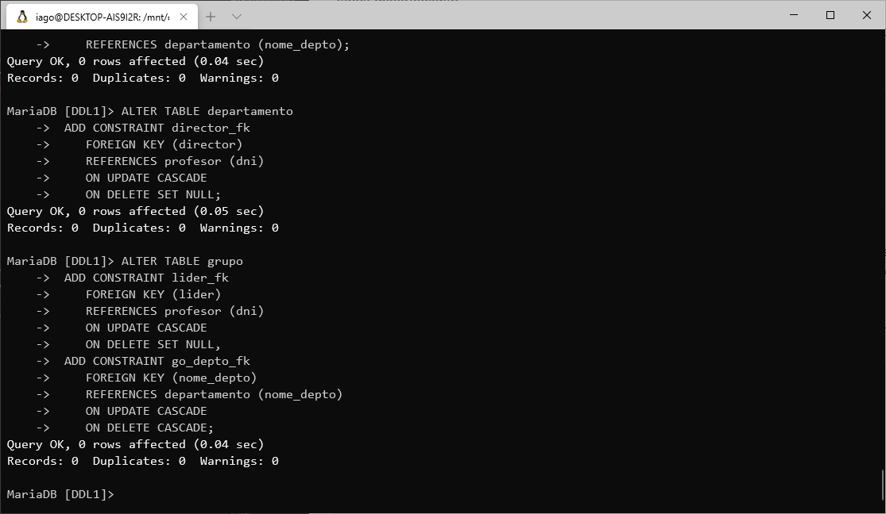

# Proxectos de Investigación

Faremos uso do exercicio resolto *Proxectos de Investigación* para crear unha base de datos nun servidor que executa MariaDB.

#### Links utiles
- [📕 Enunciado do exercicio](https://github.com/davidgchaves/first-steps-with-git-and-github-wirtz-asir1-and-dam1/tree/master/exercicios-ddl/1-proxectos-de-investigacion)
- [🐱‍💻 Instalar MariaDB en Ubuntu](../instalacion-mariadb/instalar.md)
- [📙 Apuntes de DLL -- *Data Definition Language*](../APUNTES.md#sql---data-definition-language)

## Indice

- [Crear a base de datos](#crear-a-base-de-datos)
- [Creas as taboas](#crear-as-taboas)
- [Definindo restriccións](#definindo-restriccións)
    - [DNI/NIE](#DNI-NIE)
    - [Teléfono](#teléfono)
    - [Nome](#nome)
    - [Cartos](#cantidade-de-cartos)
    - [Data de finalización](#data-de-finalización)
    - [Claves primarias](#claves-primarias)
- [Relacións](#relacións)
- [Consideracións finais](#consideracións-finais)


## Crear a base de datos

Por defecto, os usuarios de MariaDB carecen dos permisos necesarios para crear unha base de datos, iniciamos sesión no servidor utilizando a conta de usuario *root* de Ubuntu (facendo uso de `sudo`).

1. Abrimos unha ventana do Terminal de comandos e executamos `sudo mysql -u root -p`.


> Se e necesario, iniciamos o servidor usando o comando `sudo /etc/init.d/mysql start`.

2. Unha vez dentro, executamos unha sentenza para crear a nova base de datos, neste caso usaremos o nome `DDL1`:


```sql
CREATE DATABASE DDL1;
```

3. Agora, poñemonos sobre a base de datos recen creada.


```sql
USE DDL1;
```

4. E damos todo-los permisos da base de datos ao noso usuario de MariaDB:


> Se non temos usuario creado no servidor, seguimos antes [estes pasos](../instalacion-mariadb/instalar.md#arrancando-el-servidor-por-primera-vez).

```sql
GRANT ALL PRIVILEGES ON DDL1.* TO 'iago'@'%'
```

5. Pechamos a sesión do usuario *root* escribindo `\q` no shell de MariaDB e pulsando `INTRO` e lanzamos novamente o cliente `mysql -p` co noso usuario normal e poñemonos sobre a base de datos.


```sql
USE DDL1;
```


```bash
mysql -p
```

---

<p align="center"><a  href="#indice"><i>Volver ó indice</i></a></p>

---

## Crear as taboas

Examinando o esquema do exercicio deseñamos unha serie de consultas que resulten na creación dunhas taboas identicas a información do esquema, **máis tarde introduciremos as distintas relacións e restriccións máis complexas**.

Por defecto, faremos uso do tipo de datos ```VARCHAR(128)``` e da restricción ```NOT NULL``` para a maioria dos elementos, e dicir, dunha cadea de datos de tamaño variable de como máximo 128 caracteres que non acepte ```NULL``` como valor ([ainda que esto non é posible en todo-los casos](#consideracións-finais)), podemos dar calquer valor en lugar dos 128 que eu escollin, pero, **en MariaDB é obrigatorio declarar unha lonxitude maxima**.

Para os DNIs e números de telefono establecemos xa ```CHAR(9)```, para *cantidade_financiada* na taboa *financia*, usamos ```BIGINT```  e para indicar datas usamos o tipo de valor ```DATE```.

###### Taboa *sede*


```sql
CREATE TABLE sede (
    nome_sede VARCHAR(128) NOT NULL,
    campus VARCHAR(128) NOT NULL
);
```


###### Taboa *ubicacion*


```sql
CREATE TABLE ubicacion (
    nome_sede VARCHAR(128) NOT NULL,
    nome_depto VARCHAR(128) NOT NULL
);
```

###### Taboa *departamento*


```sql
CREATE TABLE departamento (
    nome_depto VARCHAR(128) NOT NULL,
    telefono CHAR(9) NOT NULL,
    director CHAR(9)
);
```

###### Taboa *grupo*


```sql
CREATE TABLE grupo (
    nome_grupo VARCHAR(128) NOT NULL,
    nome_depto VARCHAR(128) NOT NULL,
    area VARCHAR(128) NOT NULL,
    lider CHAR(9)
);
```

###### Taboa *profesor*


```sql
CREATE TABLE profesor (
    dni CHAR(9) NOT NULL,
    nome_profesor VARCHAR(128) NOT NULL,
    titulacion VARCHAR(128) NOT NULL,
    experiencia VARCHAR(128) NOT NULL,
    grupo VARCHAR(128)
);
```

###### Taboa *participa*


```sql
CREATE TABLE participa (
    dni CHAR(9),
    codigo_proxecto VARCHAR(128) NOT NULL,
    data_inicio VARCHAR(128) NOT NULL,
    data_cese VARCHAR(128),
    dedicacion VARCHAR(128) NOT NULL
);
```

###### Taboa *proxecto*


```sql
CREATE TABLE proxecto (
    codigo_proxecto VARCHAR(128) NOT NULL,
    nome_proxecto VARCHAR(128) NOT NULL,
    orzamento VARCHAR(128) NOT NULL,
    data_inicio DATE,
    grupo VARCHAR(128),
    data_fin DATE
);
```

###### Taboa *programa*


```sql
CREATE TABLE programa (
    nome_programa VARCHAR(128) NOT NULL
);
```

###### Taboa *financia*

```sql
CREATE TABLE financia (
    nome_programa VARCHAR(128) NOT NULL,
    codigo_proxecto VARCHAR(128) NOT NULL,
    numero_proxecto VARCHAR(128) NOT NULL,
    cantidade_financiada BIGINT NOT NULL
);
```
---

<p align="center"><a  href="#indice"><i>Volver ó indice</i></a></p>

---
## Definindo restriccións
Para garantizar que na nosa base de datos gardase información coherente, teremos que definir as restriccións necesarias para cada elemento.

### DNI/NIE

Este elemento atopase nas taboas *participa* e *profesor*.

Sabemos que o DNI e o NIE son unha entrada de datos de lonxitude constante, nove caracteres, so se diferencian na mascara:

- Os DNIs constan de oito dixitos e unha letra, co fin de actuar como suma de verificación dos oito dixitos anteriores.

- Os NIEs constan dunha letra, sete dixitos e outra letra, a ultima co mesmo fin que no DNI; a primeira letra pode ser:

    - Unha `X`, para os asignados antes de Xullo de 2008.
    - Unha `Y`, para os asignados a partires de Xullo de 2008.
    - Unha `Z`, prevista para cando se agoten as asignación do `Y`.


<sub>*Fonte: http://letradni.appspot.com/info.html*</sub>

Coñecendo estos datos, deseñamos a seguintes restriccións, co fin de manter a maior intregidade posible para os datos contidos:

###### Taboa *departamento*


```sql
ALTER TABLE departamento
 ADD CONSTRAINT id_mask
    CHECK (
        director REGEXP '[0-9]{8}[A-Z]'                -- Formato DNI.
	OR
        director REGEXP '[X|Y|Z][0-9]{7}[A-Z]'         -- Formato NIE.
    );
```

###### Taboa *grupo*

```sql
ALTER TABLE grupo
 ADD CONSTRAINT id_mask
    CHECK (
        lider REGEXP '[0-9]{8}[A-Z]'                -- Formato DNI.
	OR
        lider REGEXP '[X|Y|Z][0-9]{7}[A-Z]'         -- Formato NIE.
    );
```

###### Taboa *participa*


```sql
ALTER TABLE participa
 ADD CONSTRAINT id_mask
    CHECK (
        dni REGEXP '[0-9]{8}[A-Z]'                -- Formato DNI.
	OR
        dni REGEXP '[X|Y|Z][0-9]{7}[A-Z]'         -- Formato NIE.
    );
```
###### Taboa *profesor*


```sql
ALTER TABLE profesor
 ADD CONSTRAINT id_mask
    CHECK (
        dni REGEXP '[0-9]{8}[A-Z]'                -- Formato DNI.
	OR
        dni REGEXP '[X|Y|Z][0-9]{7}[A-Z]'         -- Formato NIE.
    );
```

### Teléfono
Anteriormente xa definimos para os telefonos o tipo de datos ```CHAR(9)```, xa que non queremos que  non nos interesa que estos numeros poidan ser empregados como se fosen unha entrada numerica matematica, algo que seria posible de usar `SMALLINT`, `INT` ou `BIGINT`, pero, isto ten a desvantaxe que podense introducir caracteres que non sexan numeros, para solucionar isto, facemos uso desta restricción:

###### Taboa *departamento*


```sql
ALTER TABLE departamento
 ADD CONSTRAINT phone_mask
    CHECK (
        telefono REGEXP '[0-9]{9}'
    );
```

### Nome
Supoñemos que os datos correspondentes a un nome propio ou comun non conteran maís que letras dos alfabetos das linguas da peninsula iberica, o caracter de espazo e o punto e a coma, polo tanto, deseñamos a seguintes restriccións:

###### Taboa *sede*

```sql
ALTER TABLE sede
 ADD CONSTRAINT name_mask
    CHECK (
        nome_sede REGEXP '%[A-Za-zÑñÇç .,]%'
    );
```
###### Taboa *ubicación*

```sql
ALTER TABLE ubicacion
 ADD CONSTRAINT name_mask
    CHECK (
        nome_sede REGEXP '%[A-Za-zÑñÇç .,]%'
        AND
        nome_depto REGEXP '%[A-Za-zÑñÇç .,]%'
    );
```
###### Taboa *departamento*

```sql
ALTER TABLE departamento
 ADD CONSTRAINT name_mask
    CHECK (
        nome_depto REGEXP '%[A-Za-zÑñÇç .,]%'
        AND
        director REGEXP '%[A-Za-zÑñÇç .,]%'
    );
```
###### Taboa *grupo*

```sql
ALTER TABLE grupo
 ADD CONSTRAINT name_mask
    CHECK (
        nome_grupo REGEXP '%[A-Za-zÑñÇç .,]%'
        AND
        nome_depto REGEXP '%[A-Za-zÑñÇç .,]%'
        AND
        lider REGEXP '%[A-Za-zÑñÇç .,]%'
    );
```
###### Taboa *profesor*

```sql
ALTER TABLE profesor
 ADD CONSTRAINT name_mask
    CHECK (
        nome_profesor REGEXP '%[A-Za-zÑñÇç .,]%'
    );
```
###### Taboa *proxecto*

```sql
ALTER TABLE proxecto
 ADD CONSTRAINT name_mask
    CHECK (
        nome_proxecto REGEXP '%[A-Za-zÑñÇç .,]%'
    );
```
###### Taboa *programa*

```sql
ALTER TABLE programa
 ADD CONSTRAINT name_mask
    CHECK (
        nome_programa REGEXP '%[A-Za-zÑñÇç .,]%'
    );
```
###### Taboa *financia*

```sql
ALTER TABLE financia
 ADD CONSTRAINT name_mask
    CHECK (
        nome_programa REGEXP '%[A-Za-zÑñÇç .,]%'
    );
```
### Cantidade de cartos
Supoñemos que nesta base de datos non se van a rexistrar perdas economicas, o tipo de datos `BIGINT`permitiranos gardar unha cantidade de aproximadamente 9,2 trillóns (en notación europea), **tanto en negativo como en positivo**, asi que **facemos a seguinte restricción para eliminar as cantidades negativas**:

###### Taboa *financia*

```sql
ALTER TABLE financia
 ADD CONSTRAINT money_mask
    CHECK (
        cantidade_financiada <= 0
    );
```

### Data de finalización
Por loxica unha data de finalización non pode ser anterior a data de comezo (descartaremos tamen que un proxecto acabe o mesmo día que comezou), solucionamos o incoveniente coa seguinte restricción:

###### Taboa participa

```sql
ALTER TABLE participa
 ADD CONSTRAINT pa_end_date_logic
    CHECK (
        data_cese < data_inicio
    );
```
###### Taboa proxecto

```sql
ALTER TABLE proxecto
 ADD CONSTRAINT po_end_date_logic
    CHECK (
        data_fin < data_inicio
    );
```

### Claves primarias
Por ultimo, definimos en cada taboa as suas determinadas claves primarias, que son requisito para despois poder interrelacionar os datos entre taboas.

###### Taboa *sede*
Para a taboa *sede* definimos a como clave primaria *nome_sede*.


```sql
ALTER TABLE sede
 ADD CONSTRAINT sede_pk
    PRIMARY KEY (nome_sede);
```

###### Taboa *ubicación*
Para *ubicación* definimos como clave primario o conxunto de *nome_sede* e *nome_depto*.


```sql
ALTER TABLE ubicacion
 ADD CONSTRAINT ubicacion_pk
    PRIMARY KEY (nome_sede);
```

###### Taboa *departamento*
En *departamento*, *nome_depto* sera a a clave primaria.


```sql
ALTER TABLE departamento
 ADD CONSTRAINT departamento_pk
    PRIMARY KEY (nome_depto);
```
###### Taboa *grupo*
Na taboa *grupo* o conxunto de *nome_grupo* e *nome_depto* sera a clave primaria.


```sql
ALTER TABLE grupo
 ADD CONSTRAINT grupo_pk
    PRIMARY KEY (nome_grupo, nome_depto);
```
###### Taboa *profesor*
Para a taboa profesor faremos uso do *dni* como clave primaria.


```sql
ALTER TABLE profesor
 ADD CONSTRAINT profesor_pk
    PRIMARY KEY (dni);
```
###### Taboa *participa*
En participa o conxunto de *dni* e *codigo_proxecto* seran a clave primaria.


```sql
ALTER TABLE participa
 ADD CONSTRAINT participa_pk
    PRIMARY KEY (dni, codigo_proxecto);
```
###### Taboa *proxecto*
Para proxecto usaremos *codigo_proxecto* como clave primaria, e, ademaís marcaremos *nome_proxecto* como clave alternativa (```UNIQUE``` + ```NOT NULL```).


```sql
ALTER TABLE proxecto
 ADD CONSTRAINT proxecto_pk
    PRIMARY KEY (codigo_proxecto),
 ADD CONSTRAINT proxecto_ak
    UNIQUE (nome_proxecto);
```
###### Taboa *programa*
Na taboa programa, *nome_programa* sera a clave primaria.


```sql
ALTER TABLE programa
 ADD CONSTRAINT programa_pk
    PRIMARY KEY (nome_programa);
```
###### Taboa *financia*
Por ultimo, en *financia* o conxunto *nome_programa* e *codigo_proxecto* seran a clave primaria.


```sql
ALTER TABLE financia
 ADD CONSTRAINT financia_pk
    PRIMARY KEY (nome_programa, codigo_proxecto);
```

---

<p align="center"><a  href="#indice"><i>Volver ó indice</i></a></p>

---

## Relacións
Para finalizar, con todas as taboas creadas e as restriccións definidas, procedemos a relacionar os datos entre taboas.

###### Taboa *ubicación*
Na taboa *ubicación* restrinximos *nome_sede* a valores herdarse dende a columna *nome_sede* da taboa *sede*; o mesmo caso para os valores de *nome_depto*, que deben estar herdados da taboa *departamento*.


```sql
ALTER TABLE ubicacion
 ADD CONSTRAINT sede_fk
    FOREIGN KEY (nome_sede) 
    REFERENCES sede (nome_sede),
 ADD CONSTRAINT un_depto_fk
    FOREIGN KEY (nome_depto) 
    REFERENCES departamento (nome_depto);
```

###### Taboa *departamento*
En *departamento* restrinximos os valores que toma a clave director ao *dni* dos profesores rexistrados na taboa *profesor*. Engadiremos ```ON UPDATE CASCADE``` para que o valor se actualice de cambiarse o valor referenciado e ```ON DELTE SET NULL``` para que o valor quede en ```NULL``` de eliminarse o referenciado.


```sql
ALTER TABLE departamento
 ADD CONSTRAINT director_fk
    FOREIGN KEY (director) 
    REFERENCES profesor (dni)
    ON UPDATE CASCADE
    ON DELETE SET NULL;
```

###### Taboa *grupo*
En *grupo* facemos unha restricción semellante a feita na taboa *departamento*, o *lider* so pode tomar por valor un *dni* dos profesores rexistrados, establecemos, ademais, que o valor se actualice de cambiar o valor do que se hereda e que pase a ser ```NULL``` se o elemento do que se hereda e borrado. 

Ademaís referenciamos o departamento do grupo cun dos departamentos rexistrados, que se actualice de cambiar o valor do que se referencia e que se elimine a tuplas e o departamento desaparece.


```sql
ALTER TABLE grupo
 ADD CONSTRAINT lider_fk
    FOREIGN KEY (lider) 
    REFERENCES profesor (dni)
    ON UPDATE CASCADE
    ON DELETE SET NULL,
 ADD CONSTRAINT go_depto_fk
    FOREIGN KEY (nome_depto)
    REFERENCES departamento (nome_depto)
    ON UPDATE CASCADE
    ON DELETE CASCADE;
```
###### Taboa *profesor*
Na taboa *profesor* referencias a clave grupo a un dos grupos existentes na taboa *grupo*. Marcamos o elemento para actualizarse de cambiar o valor do que se hereda e para que pase a ser  ```NULL``` de borrarse o grupo referenciado.


```sql
ALTER TABLE profesor
 ADD CONSTRAINT pr_grupo_fk
    FOREIGN KEY (grupo)
    REFERENCES grupo (nome_grupo)
    ON UPDATE CASCADE
    ON DELETE SET NULL;
```
###### Taboa *participa*
Para *participa* referenciamos o *dni* a un dos profesores rexistrados previamente na taboa *profesor* e o *codigo_proxecto* a un dos proxectos xa existentes na taboa *proxecto*.

Marcamos ```ON UPDATE CASCADE``` e ```ON DELETE CASCADE``` en ambalas duas referencias para que a tupla se actulice ou elimine segun cambien os elementos referenciados.


```sql
ALTER TABLE participa
  ADD CONSTRAINT dni_fk
    FOREIGN KEY (dni) 
    REFERENCES profesor (dni)
    ON UPDATE CASCADE
    ON DELETE CASCADE,
  ADD CONSTRAINT pa_codigo_proxecto_fk
    FOREIGN KEY (codigo_proxecto) 
    REFERENCES proxecto (codigo_proxecto)
    ON UPDATE CASCADE
    ON DELETE CASCADE;
```
###### Taboa *proxecto*
En *proxecto* referenciaremos a clave *grupo* a un *nome_grupo* existente na taboa *grupo*. Marcamos para que os datos se actulicen de cambiar o elemento referenciado e que pasen a ser ```NULL``` de eliminarse o referenciado.


```sql
ALTER TABLE proxecto
 ADD CONSTRAINT po_grupo_fk
    FOREIGN KEY (grupo) 
    REFERENCES grupo (nome_grupo)
    ON UPDATE CASCADE
    ON DELETE SET NULL;
```

###### Taboa *financia*
Por ultimo, na taboa *financia*, referenciamos *nome_programa* a un dos programas rexistados na taboa *programa* e o codigo de proxecto a un dos rexistrados en *codigo_proxecto*.

Marcamos que os elementos se actualicen de cambiar os referenciados e que as tuplas se borren de eliminarse os referenciados.


```sql
ALTER TABLE financia
 ADD CONSTRAINT nome_programa_pk
    FOREIGN KEY (nome_programa) 
    REFERENCES programa (nome_programa)
    ON UPDATE CASCADE
    ON DELETE CASCADE,
 ADD CONSTRAINT fa_codigo_proxecto_fk
    FOREIGN KEY (codigo_proxecto) 
    REFERENCES proxecto (codigo_proxecto)
    ON UPDATE CASCADE
    ON DELETE CASCADE;
```

## Consideracións finais
Cunha base de datos valeira poderianse presentar problemas cas taboas *departamento*, *grupo*, *profesor* e *proxecto* de declarar as respectivas claves *director*, *lider*, *grupo* e *grupo* como ```NOT NULL```.

Considero que é mellor non decascartar neste caso ```NULL``` como posible valor en lugar de declarar tuplas *dummy* para poder insertar datos sen ter o ```NULL``` como valor, pois so contamos con estas duas opcions, se non temos tuplas *dummy* e marcamos como ```NOT NULL``` e a base de datos esta valeira a insercción de tuplas nestas taboas sera imposible, e, ainda de contar xa con datos na base de datos, poderiamos caer declarar información falsa danando así a integridade da información.

Outra situación donde considero útil facer uso do valor ```NULL``` e no caso da data de finalización, pois esta información quiza non exista, tamen poderiase marcar ```NOT NULL``` e marcar, por exemplo, por data de finalización *31/12/9999* pero novamente estariamos a atentar contra a integridade da información.

---

<p align="center"><a  href="#indice"><i>Volver ó indice</i></a></p>
