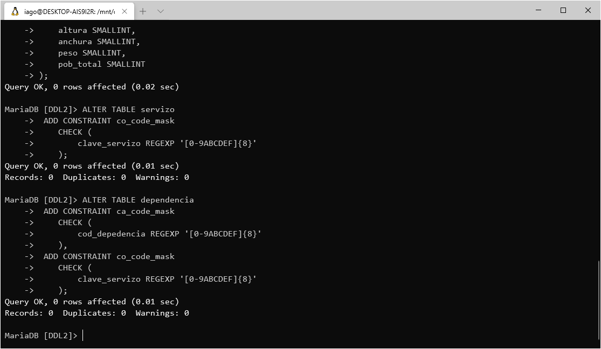
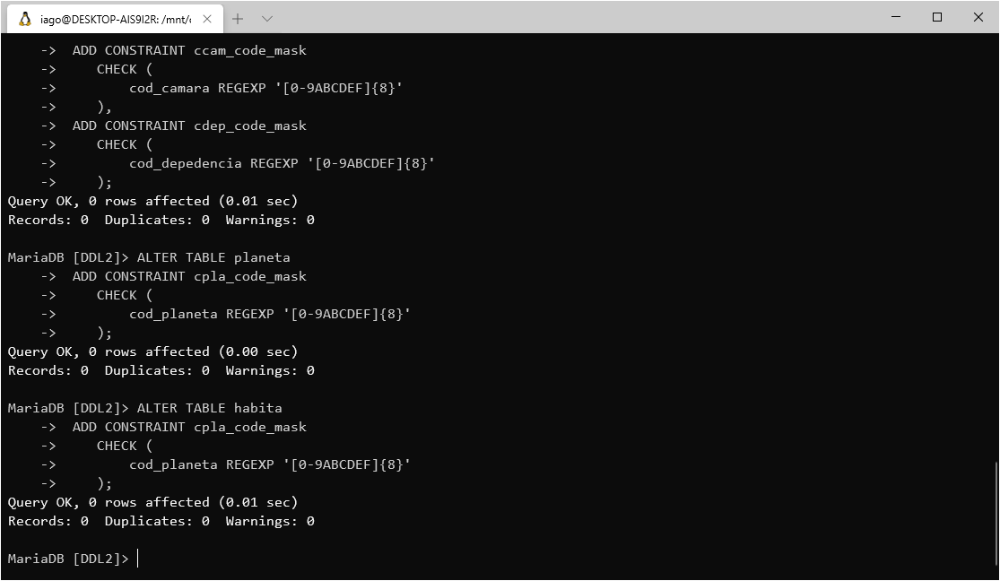

# Naves espaciais

Faremos uso do exercicio resolto *Naves espaciais* para crear unha base de datos nun servidor que executa MariaDB.

#### Links utiles
- [📕 Enunciado do exercicio](https://github.com/davidgchaves/first-steps-with-git-and-github-wirtz-asir1-and-dam1/tree/master/exercicios-ddl/2-naves-espaciais)
- [🐱‍💻 Instalar MariaDB en Ubuntu](../instalacion-mariadb/instalar.md)
- [📙 Apuntes de DLL -- *Data Definition Language*](../APUNTES.md#sql---data-definition-language)

## Indice

- [Crear a base de datos](#crear-a-base-de-datos)
- [Creas as taboas](#crear-as-taboas)
- [Definindo restriccións](#definindo-restriccións)
    - [Claves e codigos](#claves-e-codigos)
    - [Nomes](#nomes)
    - [Medidas](#medidas)
    - [Claves primarias](#claves-primarias)
- [Relacións](#relacións)

## Crear a base de datos

Por defecto, os usuarios de MariaDB carecen dos permisos necesarios para crear unha base de datos, iniciamos sesión no servidor utilizando a conta de usuario *root* de Ubuntu (facendo uso de `sudo`).

1. Abrimos unha ventana do Terminal de comandos e executamos `sudo mysql -u root -p`.


> Se e necesario, iniciamos o servidor usando o comando `sudo /etc/init.d/mysql start`.

2. Unha vez dentro, executamos unha sentenza para crear a nova base de datos, neste caso usaremos o nome `DDL2`:


```sql
CREATE DATABASE DDL2;
```

3. Agora, poñemonos sobre a base de datos recen creada.


```sql
USE DDL2;
```

4. E damos todo-los permisos da base de datos ao noso usuario de MariaDB:


> Se non temos usuario creado no servidor, seguimos antes [estes pasos](../instalacion-mariadb/instalar.md#arrancando-el-servidor-por-primera-vez).

```sql
GRANT ALL PRIVILEGES ON DDL2.* TO 'iago'@'%'
```

5. Pechamos a sesión do usuario *root* escribindo `\q` no shell de MariaDB e pulsando `INTRO` e lanzamos novamente o cliente `mysql -p` co noso usuario normal e poñemonos sobre a base de datos.


```sql
USE DDL2;
```


```bash
mysql -p
```

---

<p align="center"><a  href="#indice"><i>Volver ó indice</i></a></p>

---

## Crear as taboas

A partir do esquema deseñamos as seguintes consultas, que crearan a estructura da base de datos, **introduciremos as distintas relacións e restriccions mais tarde**.

Para as claves e codigos utilizaremos o tipo de datos `CHAR(8)`, para datas o tipo `DATE`, `INT` e `SMALLINT` para as entradas numericas con posible interese matematico, e segun o tamaño dos datos esperados.

###### Taboa *servizo*

```sql
CREATE TABLE servizo (
    clave_servizo CHAR(8) NOT NULL,
    nome_servizo VARCHAR(128) NOT NULL
);
```
###### Taboa *dependencia*

```sql
CREATE TABLE dependencia (
    cod_dependencia CHAR(8) NOT NULL,
    nome_dependencia VARCHAR(128) NOT NULL,
    clave_servizo CHAR(8) NOT NULL,
    nome_servizo VARCHAR(128) NOT NULL,
    funcion VARCHAR(128) NOT NULL,
    localizacion VARCHAR(128) NOT NULL
);
```
###### Taboa *camara*

```sql
CREATE TABLE camara (
    cod_dependencia CHAR(8) NOT NULL,
    categoria VARCHAR(128) NOT NULL,
    capacidade SMALLINT NOT NULL
);
```
###### Taboa *tripulacion*

```sql
CREATE TABLE tripulacion (
    cod_tripulacion CHAR(8) NOT NULL,
    nome_tripulacion VARCHAR(128) NOT NULL,
    cod_camara  CHAR(8) NOT NULL,
    cod_dependencia  CHAR(8) NOT NULL,
    categoria  VARCHAR(128) NOT NULL,
    antiguidade INT,
    procedencia  VARCHAR(128) NOT NULL,
    admision DATE
);
```
###### Taboa *visita*

```sql
CREATE TABLE visita (
    cod_tripulacion CHAR(8) NOT NULL,
    cod_planeta CHAR(8) NOT NULL,
    data_visita DATE,
    tempo INT
);
```
###### Taboa *planeta*

```sql
CREATE TABLE planeta (
    cod_planeta CHAR(8) NOT NULL,
    nome_planeta CHAR(8) NOT NULL,
    galaxia VARCHAR(128) NOT NULL,
    coordenadas VARCHAR(128) NOT NULL
);
```

###### Taboa *habita*

```sql
CREATE TABLE habita (
    cod_planeta CHAR(8) NOT NULL,
    nome_raza VARCHAR(128) NOT NULL,
    pob_parcial INT
);
```


###### Taboa *raza*

```sql
CREATE TABLE raza (
    nome_raza VARCHAR(128) NOT NULL,
    altura SMALLINT,
    anchura SMALLINT,
    peso SMALLINT,
    pob_total SMALLINT
);
```

---

<p align="center"><a  href="#indice"><i>Volver ó indice</i></a></p>

---

## Definindo restriccións
Para garantizar que na nosa base de datos gardase información coherente, teremos que definir as restriccións necesarias para cada elemento.

### Claves e Codigos
Deseñaremos unha restricción para que as claves e os codigos teñan una restricción que so permita facer uso de numeración hexadecimal (0-F), como estes datos, a pesares de ser numerico non teñen interese matematico, faremos uso do tipo de datos ``CHAR(8)`` (ya previamente establecido).

###### Taboa *servizo*

```sql
ALTER TABLE servizo
 ADD CONSTRAINT co_code_mask
    CHECK (
        clave_servizo REGEXP '[0-9ABCDEF]{8}'
    );
```

###### Taboa *dependencia*

```sql
ALTER TABLE dependencia
 ADD CONSTRAINT ca_code_mask
    CHECK (
        cod_depedencia REGEXP '[0-9ABCDEF]{8}'
    ),
 ADD CONSTRAINT co_code_mask
    CHECK (
        clave_servizo REGEXP '[0-9ABCDEF]{8}'
    );
```

###### Taboa *camara*

```sql
ALTER TABLE camara
 ADD CONSTRAINT ca_code_mask
    CHECK (
        cod_depedencia REGEXP '[0-9ABCDEF]{8}'
    );
```

###### Taboa *tripulacion*

```sql
ALTER TABLE tripulacion
 ADD CONSTRAINT ctri_code_mask
    CHECK (
        cod_tripulacion REGEXP '[0-9ABCDEF]{8}'
    ),
 ADD CONSTRAINT ccam_code_mask
    CHECK (
        cod_camara REGEXP '[0-9ABCDEF]{8}'
    ),
 ADD CONSTRAINT cdep_code_mask
    CHECK (
        cod_depedencia REGEXP '[0-9ABCDEF]{8}'
    );
```

###### Taboa *planeta*

```sql
ALTER TABLE planeta
 ADD CONSTRAINT cpla_code_mask
    CHECK (
        cod_planeta REGEXP '[0-9ABCDEF]{8}'
    );
```

###### Taboa *habita*

```sql
ALTER TABLE habita
 ADD CONSTRAINT cpla_code_mask
    CHECK (
        cod_planeta REGEXP '[0-9ABCDEF]{8}'
    );
```

### Nomes
Deseñamos unha restricción para gardar a integridade dos valores da base de datos que deberian ser nomes, para iso eliminamos a posibilidade de introducires ningun caracter que non sexa pertencente os alfabetos da peninsula iberica, o caracterer do espazo e o punto e a coma.

###### Taboa *servizo*

```sql
ALTER TABLE servizo
 ADD CONSTRAINT ser_name_mask
    CHECK (
        nome_servizo REGEXP '%[A-Za-zÑñÇç .,]%'
    );
```

###### Taboa *dependencia*

```sql
ALTER TABLE dependencia
 ADD CONSTRAINT ndep_name_mask
    CHECK (
        nome_dependencia REGEXP '%[A-Za-zÑñÇç .,]%'
    ),
 ADD CONSTRAINT nser_name_mask
    CHECK (
        nome_servizo REGEXP '%[A-Za-zÑñÇç .,]%'
    ),
 ADD CONSTRAINT fun_name_mask
    CHECK (
        funcion REGEXP '%[A-Za-zÑñÇç .,]%'
    ),
 ADD CONSTRAINT loc_name_mask
    CHECK (
        localizacion REGEXP '%[A-Za-zÑñÇç .,]%'
 );
```
###### Taboa *camara*

```sql
ALTER TABLE camara
 ADD CONSTRAINT cat_name_mask
    CHECK (
        categoria REGEXP '%[A-Za-zÑñÇç .,]%'
    );
```
###### Taboa *tripulacion*

```sql
ALTER TABLE tripulacion
 ADD CONSTRAINT ntrip_name_mask
    CHECK (
        nome_tripulacion REGEXP '%[A-Za-zÑñÇç .,]%'
    ),
 ADD CONSTRAINT cat_name_mask
    CHECK (
        categoria REGEXP '%[A-Za-zÑñÇç .,]%'
    ),
 ADD CONSTRAINT pro_name_mask
    CHECK (
        procedencia REGEXP '%[A-Za-zÑñÇç .,]%'
    );
```

###### Taboa *planeta*

```sql
ALTER TABLE planeta
 ADD CONSTRAINT gal_name_mask
    CHECK (
        galaxia REGEXP '%[A-Za-zÑñÇç .,]%'
    );
```

###### Taboa *habita*

```sql
ALTER TABLE habita
 ADD CONSTRAINT nra_name_mask
    CHECK (
        nome_raza REGEXP '%[A-Za-zÑñÇç .,]%'
    );
```

###### Taboa *raza*

```sql
ALTER TABLE raza
 ADD CONSTRAINT nra_name_mask
    CHECK (
        nome_raza REGEXP '%[A-Za-zÑñÇç .,]%'
    );
```

### Medidas
Por pura loxica, un peso ou a altura non poden ser negativos, asi que, eliminaremos esa posibilidade facendo uso destas restriccions.

###### Taboa *tripulacion*

```sql
ALTER TABLE tripulacion
 ADD CONSTRAINT ant_valid_value
    CHECK (
        antiguedad <= 0
    );
```
###### Taboa *visita*


```sql
ALTER TABLE visita
 ADD CONSTRAINT tempo_valid_value
    CHECK (
        tempo < 0
    );
```
###### Taboa *habita*

```sql
ALTER TABLE habita
 ADD CONSTRAINT pob_valid_value
    CHECK (
        pob_parcial <= 0
    );
```

###### Taboa *raza*

```sql
ALTER TABLE raza
 ADD CONSTRAINT alt_valid_value
    CHECK (
        altura < 0
    ),
 ADD CONSTRAINT anc_valid_value
    CHECK (
        anchura < 0
    ),
 ADD CONSTRAINT pes_valid_value
    CHECK (
        peso < 0
    ),
 ADD CONSTRAINT pob_valid_value
    CHECK (
        pob_total < 0
    );
```
### Claves primarias
Agora, editamos toda-las taboas para engadir as restriccións de clave primaria, e, ademais engadimos al claves alernativas, de habelas.

###### Taboa *servizo*
Nesta taboa utilziaremos o conxunto de *clave_servizo* e *nome_servizo* como clave primaria.

```sql
ALTER TABLE servizo
 ADD CONSTRAINT servizo_pk
    PRIMARY KEY (clave_servizo, nome_servizo);
```

###### Taboa *dependencia*
En *dependencia* o *cod_dependencia* fara de clave primaria, ademaís, marcamos *nome_dependencia* como clave alternativa (`UNIQUE` + `NOT NULL`).


```sql
ALTER TABLE dependencia
 ADD CONSTRAINT depedencia_pk
    PRIMARY KEY (cod_dependencia),
 ADD CONSTRAINT dependencia_ak
    UNIQUE (nome_dependencia);
```

###### Taboa *camara*
Na taboa camara o *cod_dependencia* sera a clave primaria.


```sql
ALTER TABLE camara
 ADD CONSTRAINT camara_pk
    PRIMARY KEY (cod_dependencia);
```

###### Taboa *tripulacion*
Para a taboa *tripulacion* *cod_tripulacion* sera a clave primaria.


```sql
ALTER TABLE tripulacion
 ADD CONSTRAINT tripulacion_pk
    PRIMARY KEY (cod_tripulacion);
```

###### Taboa *visita*
En *visita* o conxunto de *cod_tripulacion*, *cod_planeta* e *data_visita* formaran a clave primaria.


```sql
ALTER TABLE visita
 ADD CONSTRAINT visita_pk
    PRIMARY KEY (cod_tripulacion, cod_planeta, data_visita);
```

###### Taboa *planeta*
Para a taboa *planeta* teremos ao *cod_planeta* como clave priamria, xunto as claves alternativas *nome_planeta* e *coordenadas*.


```sql
ALTER TABLE planeta
 ADD CONSTRAINT planeta_pk
    PRIMARY KEY (cod_planeta),
 ADD CONSTRAINT na_planeta_ak
    UNIQUE (nome_planeta),
 ADD CONSTRAINT cs_planeta_ak
    UNIQUE (coordenadas);
```

###### Taboa *habita*
Nesta taboa o conxunto de *cod_planeta* e *nome_raza* conformaran a clave primaria.


```sql
ALTER TABLE habita
 ADD CONSTRAINT habita_pk
    PRIMARY KEY (cod_planeta, nome_raza);
```

###### Taboa *raza*
Para rematar, na taboa *raza*, a clave primaria sera *nome_raza*.


```sql
ALTER TABLE raza
 ADD CONSTRAINT raza_pk
    PRIMARY KEY (nome_raza);
```

---

<p align="center"><a  href="#indice"><i>Volver ó indice</i></a></p>

---

## Relacions
Por ultimo, relacionaremos as distintas taboas. Neste caso marcamos sempre os valores para actualizarse e borrarse en cascada en todas as relacións.

###### Taboa *dependencia*
Referenciaremos os valores da *clave_servizo* e *nome_servizo* os da *clave_servizo* e *nome_servizo* da taboa *servizo*.


```sql
ALTER TABLE dependencia
 ADD CONSTRAINT servizo_fk
    FOREIGN KEY (clave_servizo, nome_servizo) 
    REFERENCES servizo (clave_servizo, nome_servizo)
    ON UPDATE CASCADE
    ON DELETE CASCADE;
```

###### Taboa *camara*
Para a taboa camara referenciamos o *cod_dependencia* a os *cod_dependencia* da taboa *dependencia*.


```sql
ALTER TABLE camara
 ADD CONSTRAINT cod_dependencia_fk
    FOREIGN KEY (cod_dependencia) 
    REFERENCES dependencia (cod_dependencia)
    ON UPDATE CASCADE
    ON DELETE CASCADE;
```

###### Taboa *visita*
Para a *visita* vinculamos os valores de *cod_tripulación* aos da taboa *tripulacion* e o *cod_planeta* a taboa *planeta*.


```sql
ALTER TABLE visita
 ADD CONSTRAINT cod_tripulacion_fk
    FOREIGN KEY (cod_tripulacion) 
    REFERENCES tripulacion (cod_tripulacion)
    ON UPDATE CASCADE
    ON DELETE CASCADE,
 ADD CONSTRAINT cod_planeta_fk
    FOREIGN KEY (cod_planeta) 
    REFERENCES planeta (cod_planeta)
    ON UPDATE CASCADE
    ON DELETE CASCADE;
```

###### Taboa *habita*
Por ultimo, na taboa *habita* ligamos *cod_planeta* a taboa *planeta* e o *nome_raza* a taboa *raza*.


```sql
ALTER TABLE habita
 ADD CONSTRAINT hcod_planeta_fk
    FOREIGN KEY (cod_planeta) 
    REFERENCES planeta (cod_planeta)
    ON UPDATE CASCADE
    ON DELETE CASCADE,
 ADD CONSTRAINT nome_raza_fk
    FOREIGN KEY (nome_raza) 
    REFERENCES raza (nome_raza)
    ON UPDATE CASCADE
    ON DELETE CASCADE;
```